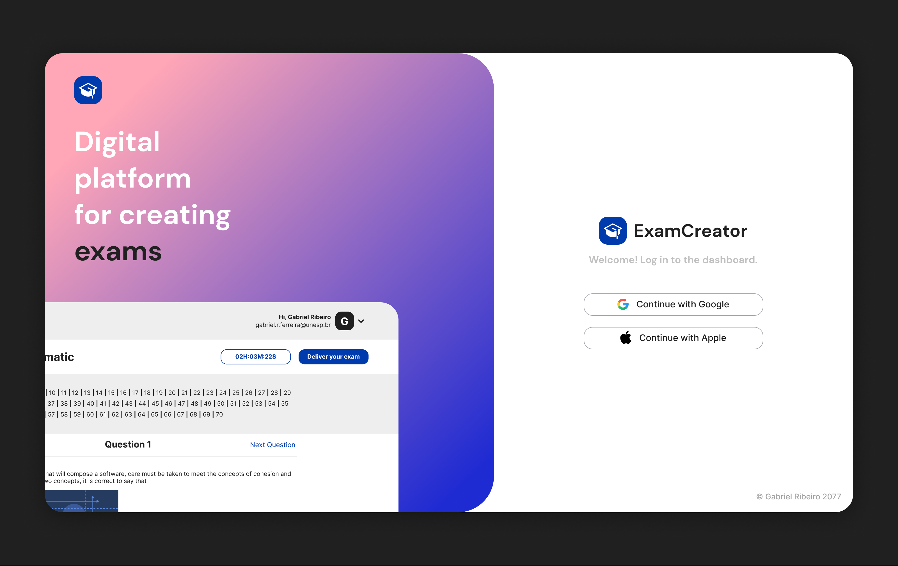

  

  

## 📜 Table of Contents

- [Project]()
- [Technologies]()
- [Layout]()

## 💻 Project

ExamCreator is a fictional web platform that helps you create online exams with alternative questions. Based in React and Firebase technologies.

## 🚀 Technologies

Brief overview of the technology stack:

- [React](https://react.js.org)
- [Typescript](https://typescriptlang.org)
- [Firebase Authentication](https://firebase.google.com)
- [Firebase Firestore Database](https://firebase.google.com)
- [Storybook](https://firebase.google.com)
- [ViteJS](https://vitejs.dev)
- And other smaller software solutions... See overview in the API [package.json](https://github.com/gabrielribeirof/exam-creator/blob/main/package.json)

## 🔖 Layout

You can see the dashboard prototype through the link below:

- [Figma](https://www.figma.com/file/gBOcImuu0U3ghvaUPz44c9/ExamCreator?node-id=0%3A1&t=NqdM8QnZaHYCbwtw-0)

---

Made with 💖 by [Gabriel Ribeiro](https://github.com/gabrielribeirof)
